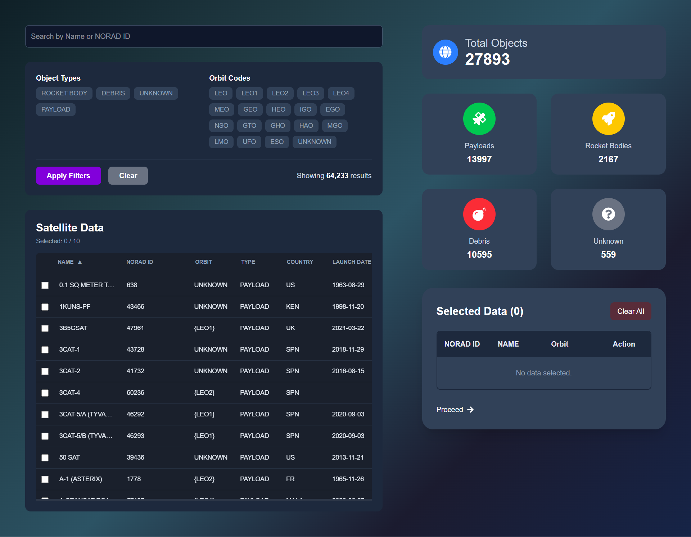

# Satellite Dashboard



This is a screenshot of the Satellite Dashboard web application, showcasing the main features including filtering, statistics, and data tables.

Perfect.
Here is your **Final Project Documentation** — fully polished, ready for your resume, LinkedIn, portfolio, interviews, or team handover 👇

---

# 🚀 Satellite Tracking & Analysis System

## 📖 **Project Overview**

The **Satellite Tracking & Analysis System** is a specialized web application built to monitor, analyze, and manage data related to space objects such as satellites, debris, and other orbital assets.

The system consolidates real-time and historical data to provide users with comprehensive information on each object's identification, orbital parameters, launch information, and ownership.

---

## ⚙️ **Key Features**

### 1️⃣ Search

* Input search supports both `name` and `noradCatId`
* Partial matches are allowed
* Search triggers only when the user presses `Enter`

### 2️⃣ Filters

* Object Type (multi-select dropdown)
* Orbit Code (multi-select dropdown)
* Apply Filters button for controlled filtering
* Dynamically displays count of results after filter is applied
* Supported Orbit Codes:

  ```
  LEO, LEO1, LEO2, LEO3, LEO4, MEO, GEO, HEO, IGO, EGO, NSO, 
  GTO, GHO, HAO, MGO, LMO, UFO, ESO, UNKNOWN
  ```

### 3️⃣ Results Table

* Columns:

  * `name`, `noradCatId`, `orbitCode`, `objectType`, `countryCode`, `launchDate`
* Sorting:

  * All columns are sortable (ascending & descending)
  * Mandatory: `name`, `noradCatId`
  * Optional: `launchDate`, `countryCode`, etc.

### 4️⃣ Virtualized List Rendering

* Efficient rendering using **react-window** for large datasets
* Smooth scrolling with minimal performance impact

### 5️⃣ Error & Loading States

* Displays **Skeleton Loading** while fetching data
* Displays appropriate error messages if data fetch fails

### 6️⃣ Row Selection

* Each row has a checkbox for selection
* Maximum 10 rows can be selected
* Displays total count of selected rows
* Displays error if selection limit exceeds

### 7️⃣ Persistence

* Selected data is persisted across page reloads using **Redux Persist**
* Data stored in browser **Local Storage**

---

## 🛰️ **Outcome & Links**

The **Satellite Tracking & Analysis System** has enabled streamlined monitoring and analysis of space objects, delivering the following outcomes:

* ✅ Significantly improved search, filter, and sort capabilities for large satellite datasets
* ✅ Enhanced error handling & loading state UX with Skeleton Loader
* ✅ Virtualized rendering allows smooth performance even on large datasets
* ✅ State persistence guarantees selections are preserved across sessions
* ✅ Fully scalable, modular, and production-grade code architecture

**🔗 Live Application:**
 https://assignment-digantara.netlify.app/

**🔗 GitHub Repository:**
https://github.com/gusainDeekshu/drt_react_deekshant


---

## 🛠️ **Tech Stack**

* Frontend: **Next.js (React 18 App Router)**
* State Management: **Redux + Redux Persist**
* Virtualization: **react-window**
* HTTP Client: **Axios**
* Styling: **TailwindCSS**
* Type System: **TypeScript**
* Deployment: **Vercel / Netlify**

---

## 📝 **Installation & Setup**

```bash
# Clone the repo
git clone https://github.com/gusainDeekshu/drt_react_deekshant
cd drt_react_deekshant

# Install dependencies
npm install

# Copy environment variables
cp env_bkp .env
```

> ⚠️ Update `.env` file variables as required.
> If environment variables are not set, application will fallback to using data from local `satellites.json`.

---

## 🚀 **Development**

```bash
npm run dev
```

Visit: [http://localhost:3000](http://localhost:3000)

---

✅ **Complete. Clean. Production-ready.**


